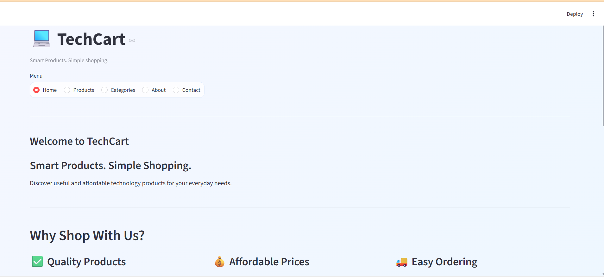
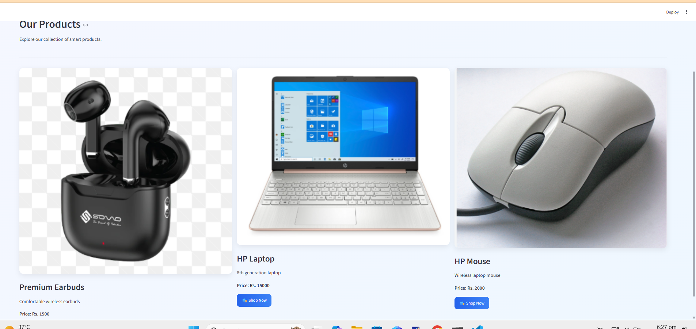

# TechCart - Streamlit Product Website

A modern Streamlit-based e-commerce landing page for showcasing tech products and allowing customers to place orders via WhatsApp.

## Overview

TechCart is a responsive product website built with Python and Streamlit. It includes:

- A home page with product highlights
- Product catalog section
- Category browsing
- About page
- Contact section with WhatsApp integration
- Stylish UI with custom CSS
- Product ordering links that open WhatsApp messages

This project is designed for small businesses or personal storefronts that want a simple, fast, and easy-to-manage online product page without a full backend.

## Features

- Responsive multi-page style interface in one Streamlit app
- Product cards with image, name, and price
- WhatsApp order buttons that pre-fill product details
- Clean modern UI with custom theme styling
- Easy-to-update product list and pricing
- Works locally and can be deployed on Streamlit Cloud

## Screenshots

### Output 1



### Output 2



## Project Structure

```text
streamlit_product_website/
├── app.py
├── earbuds.png
├── laptop.png
├── mouse.png
├── README.md
└── .git/
```

## Tech Stack

- Python 3.x
- Streamlit
- WhatsApp URL integration using urllib
- Local image assets for product display

## Prerequisites

Before running the app, make sure you have:

- Python 3.8 or newer installed
- pip package manager installed
- Internet access for installing dependencies

## Installation

1. Open a terminal in the project folder.
2. Create a virtual environment (optional but recommended):

```bash
python -m venv venv
```

3. Activate the environment:

On Windows:

```bash
venv\Scripts\activate
```

On macOS/Linux:

```bash
source venv/bin/activate
```

4. Install the required package:

```bash
pip install streamlit
```

## Running the Application

From the project directory, run:

```bash
streamlit run app.py
```

Then open the local URL shown in the terminal, usually:

```text
http://localhost:8501
```

## How It Works

The app is controlled by a single file, `app.py`.

- `WHATSAPP_NUMBER` stores the business WhatsApp number.
- `whatsapp_link()` creates a pre-filled WhatsApp message using the product name and price.
- The app uses a radio menu to switch between sections such as Home, Products, Categories, About, and Contact.
- Each product card contains a "Shop Now" button that opens WhatsApp with the selected item details.

## Customization

### Change the WhatsApp number

Open `app.py` and update:

```python
WHATSAPP_NUMBER = "+923153324597"
```

Replace it with your own WhatsApp business number.

### Add or edit products

In the `app.py` file, look for the products list in the `Home` and `Products` sections. Example:

```python
products = [
    ("Premium Earbuds", "earbuds.png", "Rs. 1500", "Comfortable wireless earbuds"),
    ("HP Laptop", "laptop.png", "Rs. 15000", "8th generation laptop"),
    ("HP Mouse", "mouse.png", "Rs. 2000", "Wireless laptop mouse"),
]
```

You can change:

- Product name
- Image filename
- Price
- Description

### Replace product images

Add your own image files in the project folder and update the filenames in `app.py`.

For example:

```python
st.image("laptop.png", use_container_width=True)
```

### Update the store branding

You can change:

- Page title: `TechCart`
- Page icon: `📱`
- Section text and captions
- Theme colors in the custom CSS block at the top of `app.py`

## Deployment

### Streamlit Cloud

1. Push the project to GitHub.
2. Go to Streamlit Cloud.
3. Click "New app".
4. Select the repository and branch.
5. Set the main file path to `app.py`.
6. Deploy.

### Other deployment options

This app can also be hosted on:

- Railway
- Render
- Hugging Face Spaces
- VPS or cloud server with Python installed

## Usage Instructions

1. Run the app locally with Streamlit.
2. Open the website in your browser.
3. Browse products and categories.
4. Click "Shop Now" on any item.
5. The app opens WhatsApp with the product information already prepared.

## Notes

- This project does not include a database or payment system.
- It is intended for product showcasing and WhatsApp-based ordering.
- For production use, you may want to add inventory management, order storage, or a real e-commerce backend.

## License

This project is provided as a simple demo/storefront example for learning and business use. Add your own license if you plan to distribute it publicly.

## Contact / Business Details

The current WhatsApp number is configured in `app.py`:

```python
WHATSAPP_NUMBER = "+923153324597"
```

Update this value if you want the product order buttons to send messages to a different phone number.

## Summary

TechCart is a simple but professional product website template built with Streamlit. It is ideal for small online stores, electronics shops, or product showcases that want to accept customer inquiries via WhatsApp quickly and easily.
